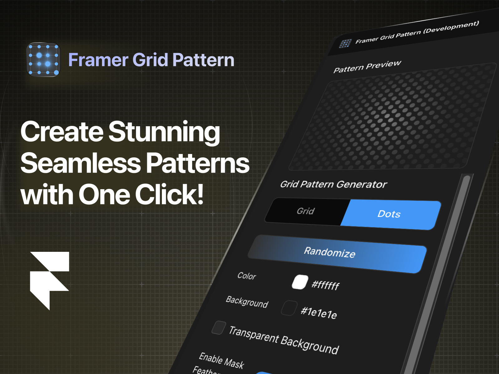

# Framer Grid Pattern Generator

A powerful Framer plugin that generates beautiful, customizable grid patterns for your designs.



## Features

* Multiple pattern types:
  * 🔲 Grid
  * 🔘 Dots (halftone)
  * 🔷 Polygon

* Powerful customization options:
  * 🎨 Pattern colors with opacity controls
  * ⚙️ Adjustable line width and cell size
  * 🔄 Rotation controls for dynamic angles
  * 🖼️ Background color options, including transparency

* Advanced styling features:
  * 🌫️ Mask feathering with intensity and size controls
  * ↔️ Edge-to-edge pattern coverage
  * 🎨 Custom gradient mask options

* Productivity tools:
  * 🎲 One-click randomize button for instant variations
  * ↩️ Reset button to restore default settings
  * 👁️ Solo mode for individual pattern adjustment

## Demo


## Installation

1. Visit the Framer Plugin Store
2. Search for "Grid Pattern Generator"
3. Click "Install" to add it to your workspace

## Usage

1. Select any frame in your design
2. Open the plugin from the right sidebar
3. Customize your pattern using the controls
4. Click "Apply to Canvas" to add the pattern to your selected frame

## Development

This plugin is built with:
* React
* TypeScript
* Vite
* Framer Plugin API

### Local Development

```bash
# Install dependencies
npm install

# Start development server
npm run dev
```

### Building for Production

```bash
# Build the plugin
npm run build

# The production files will be in the dist/ directory
```

## Contributing

We welcome contributions! Please see our [Contributing Guide](CONTRIBUTING.md) for details.

## License

MIT

## Author

Ahmed Almadhoun (madhoundes@gmail.com)

## Support

If you encounter any issues or have questions:
1. Check the [documentation](https://www.framer.com/docs/)
2. Open an issue in this repository
3. Contact support at marketplace@framer.com 